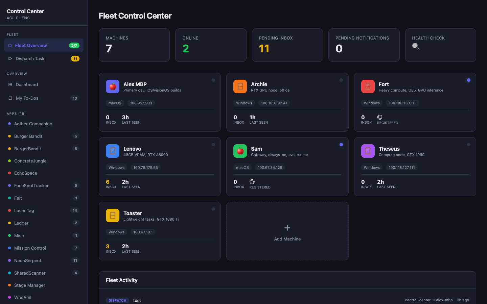
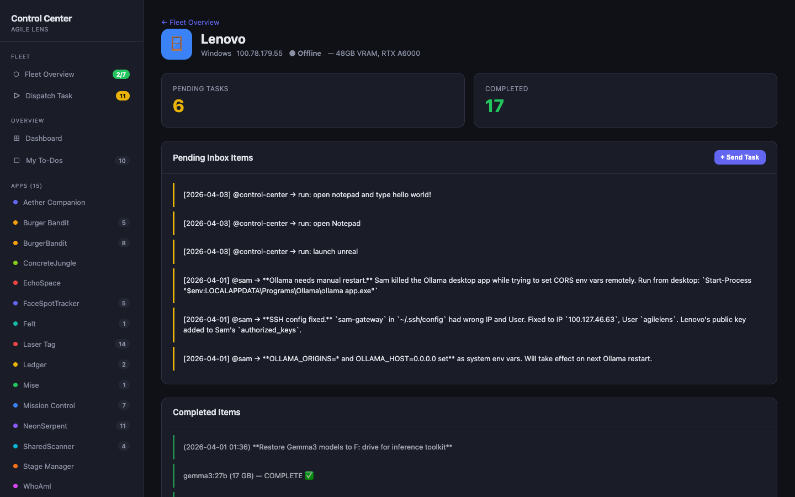
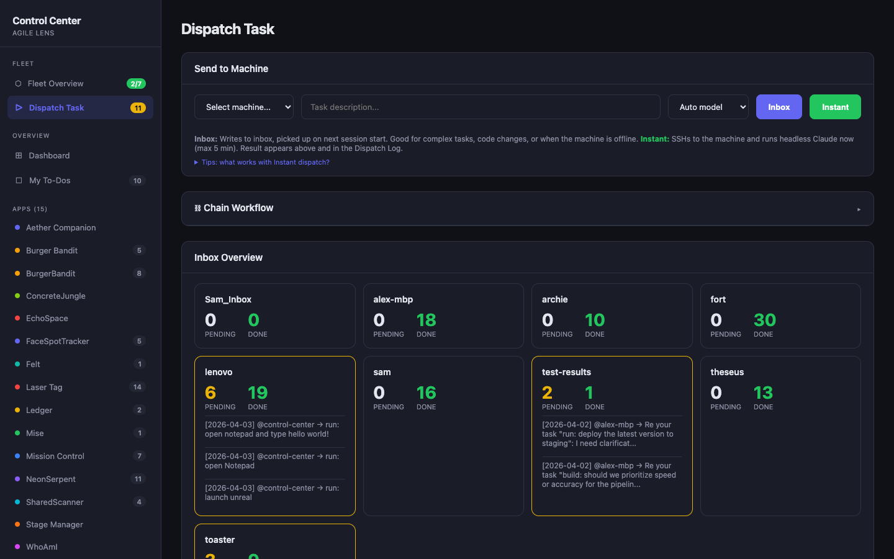
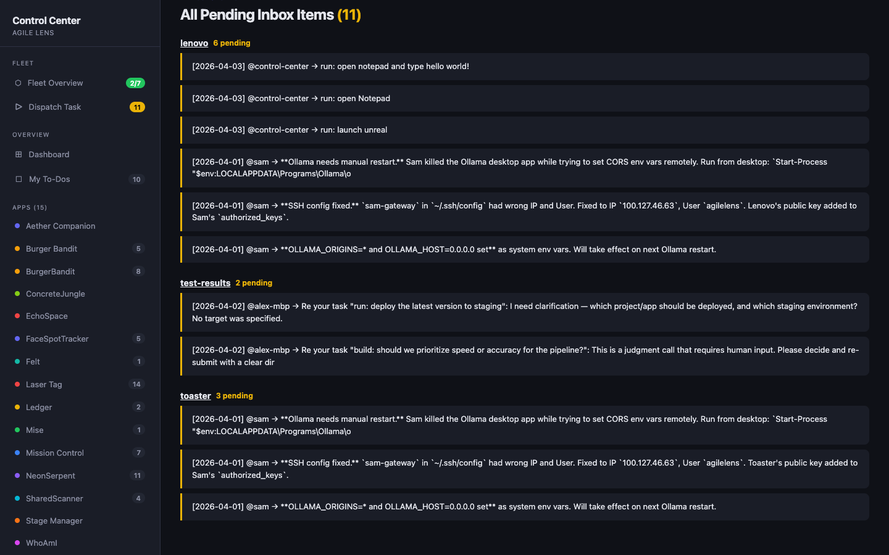

# Claude Fleet

Coordinate a fleet of computers each running [Claude Code](https://docs.anthropic.com/en/docs/claude-code), communicating asynchronously through git, with Telegram notifications for human-in-the-loop control.

```
┌──────────┐     ┌──────────┐     ┌──────────┐
│  alpha   │     │   beta   │     │  gamma   │
│ (macOS)  │     │(Windows) │     │ (Linux)  │
│Claude Code│     │Claude Code│     │Claude Code│
└────┬─────┘     └────┬─────┘     └────┬─────┘
     │                │                │
     └───── Tailscale VPN Mesh ────────┘
                      │
              ┌───────┴───────┐
              │  Shared Git   │
              │  Knowledge    │
              │  Base Repo    │
              │               │
              │  inbox/       │
              │  ├─ alpha.md  │
              │  ├─ beta.md   │
              │  └─ gamma.md  │
              └───────┬───────┘
                      │
              ┌───────┴───────┐
              │   Telegram    │
              │   Bot         │
              │               │
              │  ✅ ❌ ⚠️ 🔔   │
              │  Notifications│
              └───────────────┘
                      │
                   📱 You
```

## Screenshots

### Fleet Control Center — Machine Overview


### Machine Detail — Inbox & Completed Tasks


### Dispatch Task — Instant & Inbox Modes


### All Pending Inbox Items


## Important: Stay Out of `~/.claude/`

The `~/.claude/` directory is Claude Code's internal config directory. Accessing it directly triggers permission prompts and can interfere with Claude's operation.

**Rules:**
- Clone the knowledge base to **`~/knowledge`**, not `~/.claude/knowledge`
- Install fleet scripts to **`~/claude-fleet/`**, not `~/.claude/`
- The only file that *must* live in `~/.claude/` is **`settings.json`** (Claude Code requires it there)
- If you need a symlink for compatibility, create `~/.claude/knowledge → ~/knowledge` — but never access the KB through the symlink

## What This Does

- **Each machine runs Claude Code independently.** Your laptop, your desktop, your servers — each one can work autonomously.
- **Machines communicate through a shared git repo.** Each machine has an inbox file. Write a task to `inbox/beta.md`, push, and beta picks it up on its next session.
- **You get Telegram notifications.** When any machine finishes a task, you get a message with a status icon: ✅ success, ❌ error, ⚠️ hit turn limit, 🔔 needs your decision.
- **One command triggers all machines.** Run `fleet-inbox-check.sh` and every machine in your fleet checks its inbox in parallel.

## What This Is NOT

- Not a CI/CD system. There's no pipeline — machines work autonomously.
- Not a cloud orchestration tool. These are your physical machines, connected peer-to-peer.
- Not dependent on a central server. The git repo is the only required shared resource. The optional [Control Center](docs/11-control-center.md) adds a centralized dashboard for fleet-wide visibility and instant task dispatch, but the core inbox system works without it.

## Prerequisites

- [Tailscale](https://tailscale.com/) (free tier works) — for SSH between machines
- A private git repo (GitHub, GitLab, etc.) — the shared knowledge base
- [Claude Code](https://docs.anthropic.com/en/docs/claude-code) — installed on each machine
- [Node.js](https://nodejs.org/) — for the Telegram notification script
- A Telegram bot token (optional, for notifications) — [setup guide](telegram/setup-bot.md)

## Quick Start

### 1. Set up the network

Install [Tailscale](https://tailscale.com/download) on every machine and join them to the same tailnet. Verify with:

```bash
# From any machine
ssh <other-machine-name>
```

See [docs/02-tailscale-setup.md](docs/02-tailscale-setup.md) for details.

### 2. Create the shared knowledge base

Create a private git repo and clone it to `~/knowledge` on every machine:

```bash
# On each machine
git clone git@github.com:you/fleet-kb.git ~/knowledge
```

Set up the structure:

```bash
cd ~/knowledge

# Add the navigation guide (AI agents read this first)
cp /path/to/claude-fleet/templates/CLAUDE.md .

# Create inboxes
mkdir inbox
cp /path/to/claude-fleet/templates/inbox/example-machine.md inbox/alpha.md
cp /path/to/claude-fleet/templates/inbox/example-machine.md inbox/beta.md

# Create daily log and decision folders
mkdir -p daily decisions projects

git add . && git commit -m "init: KB structure" && git push
```

Optionally, create a compatibility symlink (some tools expect `~/.claude/knowledge`):
```bash
ln -s ~/knowledge ~/.claude/knowledge
```

See [docs/04-knowledge-repo.md](docs/04-knowledge-repo.md) for the full setup, including KB structure, CLAUDE.md navigation guide, and formatting rules.

### 3. Install Claude Code on every machine

```bash
# macOS / Linux
npm install -g @anthropic-ai/claude-code

# Verify
claude --version

# Authenticate
claude
# Then type: /login
```

See [docs/03-claude-code-install.md](docs/03-claude-code-install.md) for platform-specific notes.

### 4. Install the hooks

Clone this repo and copy the scripts to `~/claude-fleet/` on each machine:

```bash
git clone https://github.com/ibrews/claude-fleet.git ~/claude-fleet-repo
mkdir -p ~/claude-fleet
cp ~/claude-fleet-repo/scripts/kb-inbox-check.sh ~/claude-fleet/
cp ~/claude-fleet-repo/scripts/kb-session-end.sh ~/claude-fleet/
cp ~/claude-fleet-repo/scripts/notify-human.js ~/claude-fleet/
cp ~/claude-fleet-repo/scripts/fleet-inbox-check.sh ~/claude-fleet/
chmod +x ~/claude-fleet/*.sh
```

**Important: Machine name detection.** Fleet scripts identify your machine by hostname to find the right inbox file (`inbox/<name>.md`). If your hostname doesn't match your inbox filename, set this environment variable:

```bash
export FLEET_MACHINE_NAME=alpha  # must match your inbox filename
```

Add it to your shell profile (`~/.bashrc`, `~/.zshrc`) so it persists. See [docs/07-hooks.md](docs/07-hooks.md) for details.

Add to `~/.claude/settings.json` (the one file that must live in `~/.claude/`):

```json
{
  "permissions": {
    "defaultMode": "bypassPermissions",
    "deny": ["Bash(rm -rf /)", "Bash(sudo rm -rf *)"]
  },
  "hooks": {
    "SessionStart": [
      { "hooks": [{ "type": "command", "command": "$HOME/claude-fleet/kb-inbox-check.sh", "timeout": 30 }] }
    ],
    "Stop": [
      { "hooks": [{ "type": "command", "command": "$HOME/claude-fleet/kb-session-end.sh", "timeout": 30 }] },
      { "hooks": [{ "type": "command", "command": "node $HOME/claude-fleet/notify-human.js", "timeout": 10 }] }
    ]
  }
}
```

> **Note:** `bypassPermissions` prevents Claude from pausing for approval prompts, which is essential for autonomous fleet operation. See [templates/settings.json](templates/settings.json) for the full structure including mid-session notification hooks.

### 5. Configure the fleet trigger

Edit `~/claude-fleet/fleet-inbox-check.sh` — update `ALL_MACHINES` with your machine names and `get_claude_cmd()` with the correct Claude paths for each machine.

### 6. Test it

```bash
# Send a test message to one of your machines
cd ~/knowledge
echo '- [ ] [2024-01-01 12:00] @alpha → check: Are you alive? Reply to my inbox.' >> inbox/beta.md
git add inbox/ && git commit -m "test: ping beta" && git push

# Trigger beta to check its inbox (from the machine that has fleet-inbox-check.sh configured)
~/claude-fleet/fleet-inbox-check.sh beta
```

## Documentation

| Guide | Description |
|-------|-------------|
| [Fleet Overview](docs/01-fleet-overview.md) | Architecture and concepts |
| [Tailscale Setup](docs/02-tailscale-setup.md) | Connecting your machines |
| [Claude Code Install](docs/03-claude-code-install.md) | Per-platform installation |
| [Knowledge Repo](docs/04-knowledge-repo.md) | Setting up the shared git repo |
| [Inbox System](docs/05-inbox-system.md) | The messaging protocol |
| [Telegram Bot](docs/06-telegram-bot.md) | Notifications and remote control |
| [Hooks](docs/07-hooks.md) | Claude Code hook configuration |
| [Fleet Trigger](docs/08-fleet-trigger.md) | Triggering all machines at once |
| [Troubleshooting](docs/09-troubleshooting.md) | Common issues and fixes |
| [Notifications](docs/10-notifications.md) | Mid-session inter-machine notifications |
| [Control Center](docs/11-control-center.md) | Web dashboard for fleet management and instant dispatch |

## Try It — Fleet Commander

**[Launch Fleet Commander](docs/fleet-commander.html)** — an interactive browser game that teaches you how claude-fleet works. Build your fleet, spec your machines, dispatch tasks, and learn the architecture by playing. No installation required.

## Examples

- [Two-Machine Fleet](examples/two-machine-fleet/) — Minimal laptop + desktop setup
- [Five-Machine Fleet](examples/five-machine-fleet/) — Multi-role fleet with specialization

## Fleet Task Dispatch (Headless Subagents)

Dispatch a task to any fleet machine and get results back. Uses `claude -p` (headless mode) over SSH:

```bash
# Simple query
node scripts/fleet-task.js beta "Find all TODO comments in the project" --tools "Read,Glob,Grep"

# Get structured JSON output
node scripts/fleet-task.js gamma "Summarize the README" --json

# Fire and forget (long-running builds, etc.)
node scripts/fleet-task.js beta "Build the APK and upload it" --timeout 600 --bg

# Use a specific model
node scripts/fleet-task.js beta "Review this PR" --model claude-sonnet-4-6
```

**When to use this vs. the inbox system:**
- **fleet-task.js**: Real-time results needed, task is self-contained, takes < 10 minutes
- **Inbox/triggers**: Async is fine, task needs human review, long-running work

### Windows Support (Node.js Scripts)

All hooks have Node.js equivalents for Windows machines (no bash/Python dependency):

| Bash (macOS/Linux) | Node.js (cross-platform) |
|--------------------|--------------------------|
| `kb-inbox-check.sh` | `kb-inbox-check.js` |
| `kb-session-end.sh` | `kb-session-end.js` |
| `check-notifications.sh` | `check-notifications.js` |
| `fleet-sync-notifications.sh` | `fleet-sync-notifications.js` |
| `send-notification.sh` | `send-notification.js` |

See [templates/settings-windows.json](templates/settings-windows.json) for the Windows hook configuration.

## How It Works Under the Hood

The magic is in four hooks:

1. **SessionStart** (`kb-inbox-check.sh`): When Claude starts, it pulls the knowledge base and checks for pending inbox items. If found, it injects them into Claude's context as high-priority instructions, so Claude processes them before doing anything else.

2. **Stop** (`kb-session-end.sh`): When Claude finishes, it auto-commits and pushes any changes to the knowledge base. No work is lost.

3. **Stop** (`notify-human.js`): After finishing, it sends a Telegram notification with a status icon so you know what happened without checking the terminal.

4. **PostToolUse** (`check-notifications.sh`): After every tool call, checks for mid-session notifications from other machines. If beta finishes a task that alpha requested, alpha finds out within ~60 seconds — no need to wait for the next session start.

The fleet trigger script (`fleet-inbox-check.sh`) SSHes into every machine in parallel and runs `claude -p "check your inbox"` — which triggers the SessionStart hook, which processes the inbox.

## License

MIT
